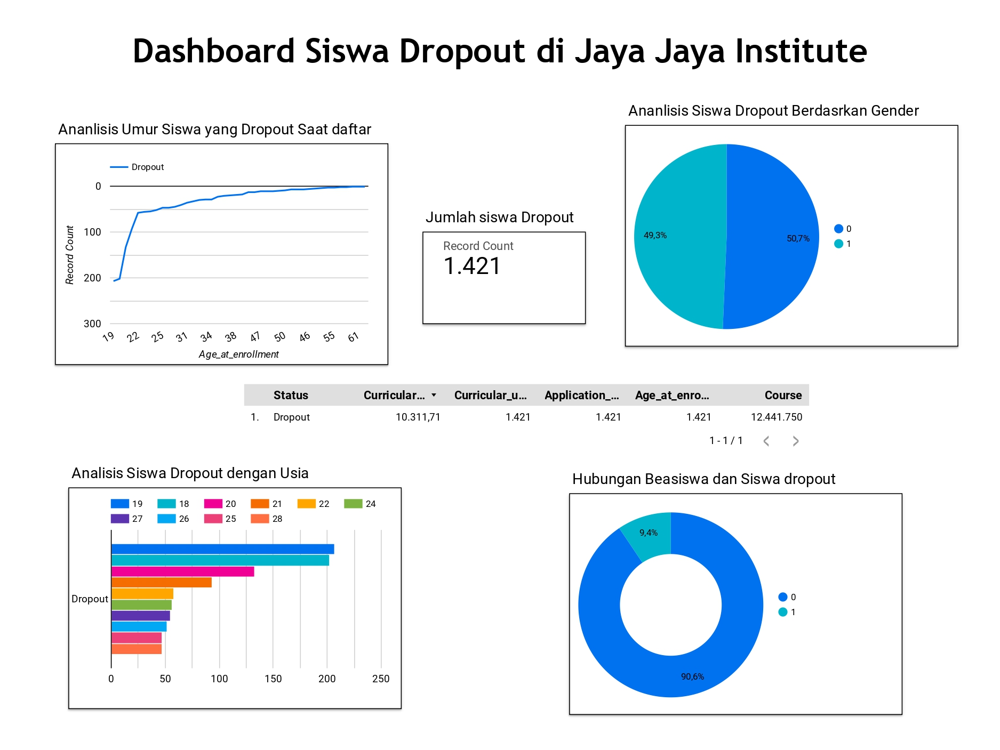

# Proyek Akhir: Menyelesaikan Permasalahan Perusahaan Edutech

## Business Understanding
Proyek ini bertujuan membantu meningkatkan performa akademik siswa serta mengurangi angka putus kuliah (dropout). Dengan berkembangnya teknologi dan analisis data, proyrk ini ingin menggunakan data terkait mahasiswa yang mereka peroleh dari berbagai sumber (demografi, jalur akademik, dan faktor sosial ekonomi) untuk membangun model yang dapat memprediksi keberhasilan akademik dan dropout mahasiswa sejak awal perkuliahan. Dengan prediksi ini, perusahaan dapat membantu institusi pendidikan menawarkan solusi yang tepat sasaran kepada mahasiswa.

### Permasalahan Bisnis
1. Jumlah siswa yang dropout tinggi mengindikasikan ada suatu hal negatif memengaruhinya.
2. Tidak adanya sistem prediksi dini untuk mengidentifikasi siswa yang berpotensi dropout.
3. Institusi ingin memahami faktor-faktor penyebab dropout untuk menargetkan intervensi yang tepat.

### Cakupan Proyek
- **Pengumpulan Data:** Mengumpulkan data dari berbagai sumber yang berisi informasi terkait mahasiswa, termasuk jalur akademik, demografi, sosial ekonomi, dan performa akademik.
- **Data Understanding:** Melakukan eksplorasi data untuk memahami pola, tren, dan hubungan antar fitur dalam dataset, serta mengidentifikasi variabel-variabel yang berpotensi mempengaruhi keberhasilan akademik dan risiko dropout.
- Data Preparation: Melakukan pembersihan data, penanganan missing values, transformasi fitur, dan encoding untuk memastikan data siap digunakan dalam pengembangan model machine learning.
- **Pengembangan Model:** Membangun model machine learning menggunakan teknik yang sesuai untuk memprediksi risiko dropout dan keberhasilan akademik mahasiswa, serta melakukan tuning hyperparameter untuk meningkatkan performa model.
- **Evaluasi:** Mengukur kinerja model yang dikembangkan menggunakan metrik evaluasi yang relevan (seperti akurasi, presisi, dan recall), dan melakukan analisis lebih lanjut untuk memastikan model memenuhi kebutuhan bisnis dan akurasi yang diharapkan.

### Persiapan

Sumber data: Sumber data: Data berasal dari informasi masing-masing pegawai yang dikumpulkan oleh Jaya Maju Institut. [dataset](https://github.com/dicodingacademy/dicoding_dataset/tree/main/students_performance)

Setup environment:
```bash
import pandas as pd
import numpy as np
import matplotlib.pyplot as plt
import seaborn as sns

from sklearn.preprocessing import LabelEncoder
from sklearn.model_selection import train_test_split

#model machine learning
from sklearn.linear_model import LogisticRegression
from sklearn.ensemble import RandomForestClassifier
from sklearn.svm import SVC
from xgboost import XGBClassifier

# evaluasi model
from sklearn.metrics import confusion_matrix, recall_score, f1_score, accuracy_score, precision_score

# deploy
from joblib import dump, load
```
### Data Understanding
- **Dataset sttsus student:** Dataset yang digunakan adalah tentang performa murid dengan jumlah data sebanyak 4424 baris dan 37 kolom yang terbagi menjadi 36 kolom independen yang akan digunakan untuk melatih model dan 1 kolom yaitu kolom Status sebagai targetnya.

## Business Dashboard
Business dashboard yang dibuat menggunakan Looker Studio. Dashboard ini memberikan informasi yang jelas mengenai performa akademik siswa dan indikator dropout. Salah satu faktor utama yang ditemukan adalah rasio performa akademik pada semester 1 dan 2. Siswa dengan rasio rendah, dihitung dari jumlah unit kurikulum yang diambil (enrolled) dibandingkan dengan yang lulus (approved), cenderung memiliki risiko dropout yang lebih tinggi.  [dashboard] (https://lookerstudio.google.com/u/0/reporting/997aa687-310d-4269-8a1e-182fd01480f9/page/E1uvE)<br>
 <br>
gambar 1 dashboard<br>

## Menjalankan Sistem Machine Learning
### How to Run
1. Clone the repository or download the source code.
```bash
https://github.com/halimsajidi/Student-Performance-Predictions.git
```
2. Setup Environment
```bash
conda create --name main-ds python
conda activate main-ds
```
3. Install the required Python packages
```bash
cd dashboard
```
```bash
pip install -r requirements.txt
```
4. Run the Streamlit app using:
```bash
streamlit run app.py
```
4. Buka tautan yang disediakan oleh Streamlit untuk mengakses dasbor di browser web Anda.
5. uploade test data untuk mencoba aplikasi machine learning.

[StreamlitApp](https://s6kk3tckfbfcj2u6rofppd.streamlit.app/)


## Conclusion
Analisis yang dilakukan menunjukkan bahwa siswa dengan performa akademik rendah di awal masa studi berpotensi tinggi untuk dropout. Dengan menggunakan model prediksi yang dibangun berdasarkan data akademik dan faktor lainnya, pihak Jaya Jaya Institut dapat memberikan intervensi dini kepada siswa yang berisiko. Dashboard yang dibuat memungkinkan pihak institusi untuk memonitor performa siswa secara real-time dan mengambil tindakan yang tepat sesuai data yang disajikan.

Laporan ini memberikan dasar untuk perbaikan strategi pembelajaran dan dukungan akademik di masa depan.

### Rekomendasi Action Items
- **Intervensi Awal:** Mengidentifikasi mahasiswa yang berisiko tinggi untuk dropout sejak semester pertama, terutama berdasarkan jenis kelamin, status pernikahan, dan usia pendaftaran, sehingga intervensi seperti konseling atau bimbingan tambahan dapat diberikan.
- **Dukungan Keuangan:** Memberikan lebih banyak kesempatan beasiswa kepada siswa yang berpotensi, karena ini dapat meningkatkan peluang mereka untuk lulus.
- **Pendekatan Khusus Berdasarkan Jurusan:** Menyesuaikan program dukungan atau bimbingan akademik berdasarkan jurusan yang memiliki tingkat dropout lebih tinggi, seperti jurusan management.
- **Fokus pada Nilai Akademik:** Menyediakan program bimbingan belajar atau tutor tambahan bagi mahasiswa dengan nilai akademik rendah agar dapat meningkatkan performa akademik dan mengurangi risiko putus kuliah.

Dengan memahami faktor-faktor yang mempengaruhi tingkat dropout, institusi pendidikan dapat mengambil langkah-langkah proaktif untuk mendukung mahasiswa dalam menyelesaikan studi mereka.
